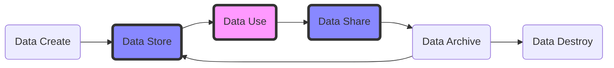
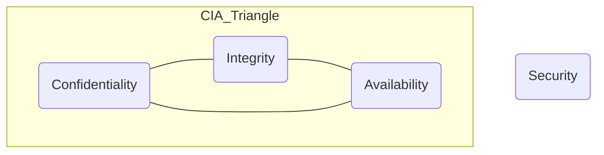

# Introduction to a Secure Data Sharing System

[TOC]

## 1. Project Description

Problems commonly found in the traditional architecture of medical institutions include

- construction redundancy
- duplicate investment
- low utilization efficiency
- difficult integration and sharing

In order to solve these problems, a simple idea is to build a centralized medical data sharing platform, but due to the sensitivity of medical data, as well as privacy and security issues, data sharing is much more difficult.

Our **Health Care Big Data Platform** is designed to create a one-stop platform for medical data users and provide a data center for different medical institutions. At the same time, from the perspective of the data life cycle, to ensure security in data sharing. On the basis of existing hospital information construction, combined with mature network security services, the hospital business process can become intelligent, convenient and mobile.

This work is dedicated to solving the problem of secure data sharing with existing mature technologies, in which we assume that **the platform itself is trusted**. 

At the same time, the main goal of this project is to quantitatively assess the security of existing platforms built with mature technologies, after which the latest, more provably secure technologies can be used to assess the security enhancements to the system.

## 2. Background Knowledge

Cybersecurity services generally have three dimensions

- Confidentiality
- Integrity
- Availability

And in the era of big data, data itself is the most important asset, and by synthesizing previous research, we propose a data lifecycle model applicable to data security sharing analysis.







## 3. Design & Implementation

Notice that the business logic implementation and design may be slightly different, but the key is to evaluate how to mitigate potential risks by protecting the business implementation with proven technology.

### 3.1 Logical Diagram

> 

The key point is that **patients themselves are the true owners of medical data** under the premise that healthcare providers are willing to access our healthcare platform. Therefore, all access to a patient's medical data requires the patient's authorization.

### 3.2 Software Design

A simple version to illustrate the relationships among user, platform and hospital, 

> 

A detailed version to illustrate the software implementation logic, 

> 

### 3.3 Software Implementation

Code will be pushed to github soon.

#### Backend + Frontend

```python
Sprintboot-Bootstrap-Postgresql
├─┬ backend     → backend module with Spring Boot code
│ ├── src				
│ └── pom.xml
├─┬ frontend    → frontend module with Bootstrap js code
│ ├── src
│ └── pom.xml
└── pom.xml     → Maven parent pom managing both modules
```

#### Database

For the database structure, you can refer to the software design drawings

#### Screenshots of main features

| Item                                                         |
| ------------------------------------------------------------ |
| Login page：                                                 |
|  |
| Patient records page:                                        |
|  |
| Patient info update page:                                    |
|  |
| Patient authorize page:                                      |
|  |
| Doctor records page:                                         |
|  |
| Reset Password:                                              |
|  |
| Register Account:                                            |
|  |

## 4. Security Analysis

### 4.1 Top-10 Threats and relative protection in Database System

Enterprise database and information storage infrastructures, holding the crown jewels of an organisation, are subject to a wide range of abuses and attacks, particularly when left vulnerable by poor system design or configuration.

_We refer it to enhance our database application, we can do it like a questionnaire or checklist, if we consider the relative issue, mark it and get one score._

| attack                                             | suggestion                                                   |      |                                                              |                   |
| -------------------------------------------------- | ------------------------------------------------------------ | ---- | :----------------------------------------------------------- | ----------------- |
| Cloud Configuration Errors                         | 1. Knowing what data you hold (location, procedure,configuration) | √    | medical data                                                 | /                 |
|                                                    | 2. Awaring that cloud services database are open to internet | √    | separate data server                                         | Postgresql        |
|                                                    | 3. Strong authentication by default                          | √    | 2-factor                                                     | Java              |
|                                                    | 4. Implement monitor procedures on your cloud services       | √    | log4j.jar                                                    | Java              |
| SQL Injection(use supplied input without checking) | 1. Avoid the use of dynamic queries.  Use prepared statements with parameterized queries. | √    | preparedStatement                                            | Java              |
|                                                    | 2. Check users' parameters before using them.                | √    | verify input data                                            | Java + JS         |
|                                                    | * bonus: monitor all dynamic queries in case someone bypass  | √    | Log4j.jar + sql log                                          | Java + Postgresql |
|                                                    | 3. NoSQL databases should also be controled                  | X    | no nosql db yet                                              |                   |
| Weak Authentication                                | 1. brute force control, blacklist&trail frequences.          | √    | limit frequence                                              | Postgresql        |
|                                                    | 2. Donnot encourage user to change password frequently. (but sometimes) | √    | record change time                                           | Java              |
|                                                    | 3. Multi-factor authentication.                              | √    | 2-factor (password+ verifycode)                              | Java              |
|                                                    | 4. Donnot store password in plaintext.                       | √    | h(password, salt)                                            | Java + Postgresql |
|                                                    | 5. Strongly protect the application database credentials and make sure they are unguessable | √    | Store in safe enviroment and in ciphertext                   | OS                |
| Privilege Abuse                                    | 1. User access to data should be rate limited                | √    | rate limit                                                   | Postgresql        |
|                                                    | 2. Not expose interfaces which allow arbitrary queries and bulk export of data. | √    | Only can access via stored procedure and function            | Postgresql        |
|                                                    | 3. If must use bulk of data, log, audit, limited as few people as possible. | √    | only data owner can access their whole data                  | Java + Postgresql |
| Excessive Privilege                                | 1. Role based access controls                                | √    | Reader, writer, admin                                        | Postgresql        |
|                                                    | 2. When staff change roles, their permissions are updated to reflect this | √    | if doctor are unauthorized by patient, he do not have read right anymore | Postgresql        |
|                                                    | 3. Regular, but not necessarily frequent, reviews the account status | X    | No such concern yet                                          |                   |
| Inadequate logging and weak auditing               | 1. What information you need to collect                      | √    | sql log and java log                                         | Postgresql + Java |
| ==logging is the collection of data==              | 2. Consider how your logging data will be secured            | √    | Protect logfile by OS                                        | OS                |
| ==auditing is someone actually looking at it==     | 3. Implement procedures for auditing the data collected so you know when something is amiss (displayed in a meaningful way) | X    | IPS not yet                                                  |                   |
|                                                    | 4. Implementing network-based audit appliances which monitor all database requests at a ==granular level== and are independent of all users. | X    |                                                              |                   |
| DoS                                                | 1. Cloud based service protection                            | X    | no cloud cluster yet                                         |                   |
|                                                    | 2. Request rate limiting                                     | √    |                                                              |                   |
| Exploiting unpatched services                      | 1. Maintain a complete and up to date inventory of the software components | √    | update server software (stable version)                      |                   |
|                                                    | 2. Establish a vulnerability management process (priority, assessment) | X    |                                                              |                   |
| Insecure system architecture                       | 1. Boundary protection + depth defence                       | √    | Physical firewall + OS detect                                | OS                |
|                                                    | 2. Put internal data and external data into two parts        | √    | Different data into different db, such as role and records   | Postgresql        |
|                                                    | 3. Review the security of the management interfaces          | √    | management interface are not exposed to internet in the same way like login page | Java + JS         |
| Inadequate Backup                                  | 1. Backups should be encrypted to protect confidentiality and integrity of the data | √    | pg_probackup                                                 | Postgresql        |
|                                                    | 2. online and offline backup (ransomware)                    | √    | RAID 5 + Tape                                                | Postgresql + OS   |
|                                                    | 3. Resilience within cloud services                          | X    |                                                              |                   |
|                                                    | ( backups are not subject to the same threats as the live data and that full compromise of the live data environment cannot also compromise your backups. And do test your restore procedures, regularly.) |      |                                                              |                   |

We will find that we get a score :  ==26 / 33==  . Most of those not considered are IPS(Intrusion Protect System) and IDS (Intrusion Detect System) related module because there exists no enough data to support their development, which will be considered in the future.

### 4.2 Other Good Practices

1. Spring boot security to protect our api and CSRF attack
2. transparent encryption to protect data physically
3. Data Transformed between network via SSL
4. Expose less port

... (Safety considerations for many engineering implementations are no longer listed)

## 5. Project Issues

Mainly are the openning issues,

1. Safety of data sharing is guaranteed by platform, which is not so convincing.
2. Side-channel attack are hard to avoid.
3. Indicators to quantify risk could be further optimized 


a